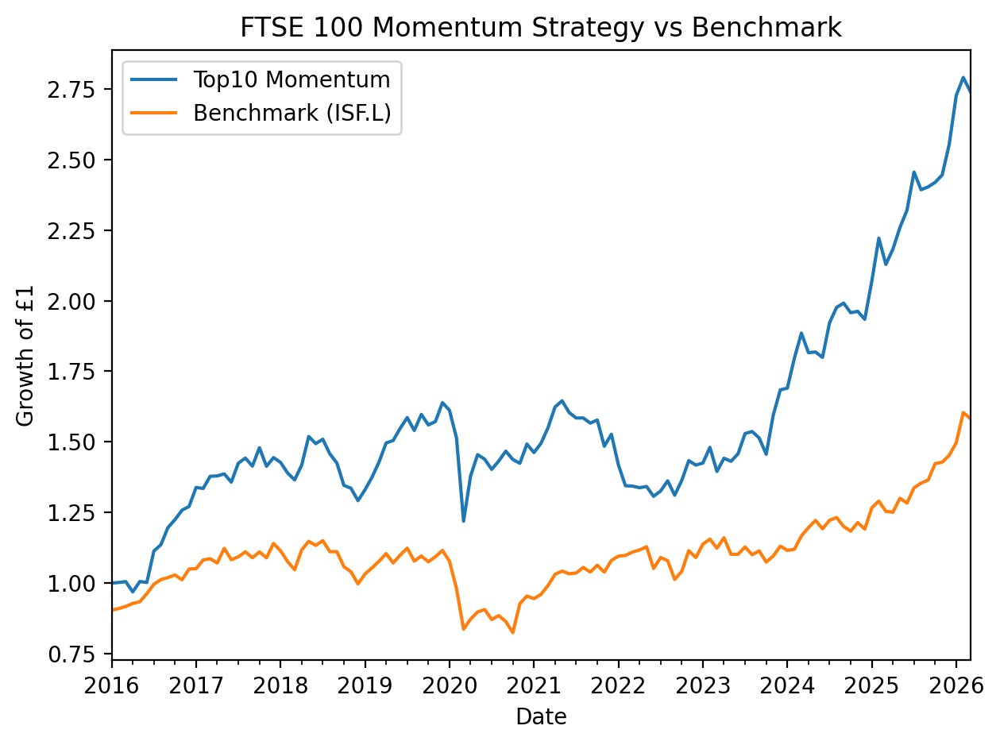

# FTSE 100 Momentum Strategy

## Overview
This project implements a 12–1 momentum strategy on FTSE 100 equities using monthly rebalancing.

The strategy:
- Selects top 10 stocks ranked by 12-month momentum (skipping the most recent month)
- Rebalances monthly
- Includes transaction cost modeling
- Benchmarks against ISF.L (iShares FTSE 100 ETF)

## Strategy Logic
1. Download daily price data via yfinance
2. Convert to month-end prices
3. Compute 12–1 momentum signal
4. Allocate equal weight to top 10 stocks
5. Apply transaction costs
6. Compute equity curve and risk metrics

## Results

Backtest Period: Jan 2016 – Mar 2026

| Metric | Value |
|--------|-------|
| Sharpe Ratio | 3.52 |
| Max Drawdown | -25.6% |
| Beta (vs FTSE ETF) | 0.79 |

The strategy produced strong risk-adjusted returns over the sample period, with lower market beta and controlled drawdowns relative to the benchmark.

Note: The universe uses a static FTSE constituent list, which may introduce survivorship bias. This project is intended as a systematic strategy demonstration rather than an institutional-grade production backtest.

## Example Output



## How To Run

```bash
pip install -r requirements.txt
python run.py