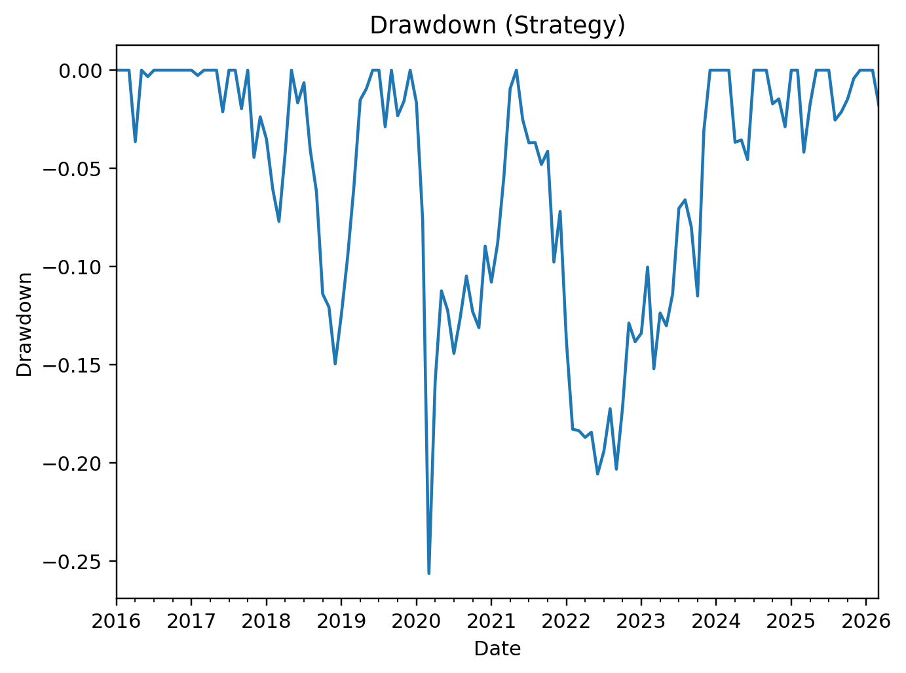
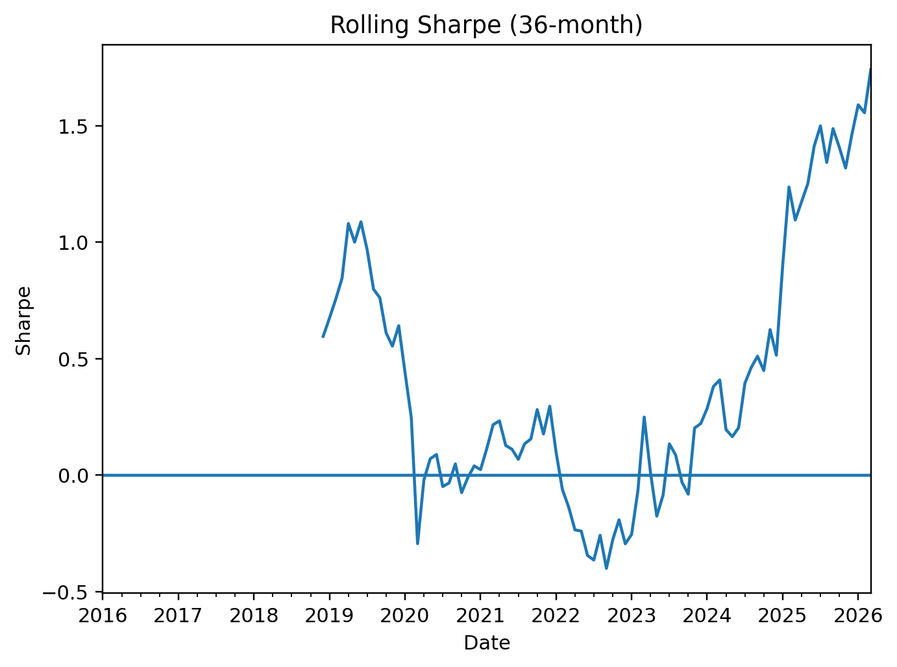
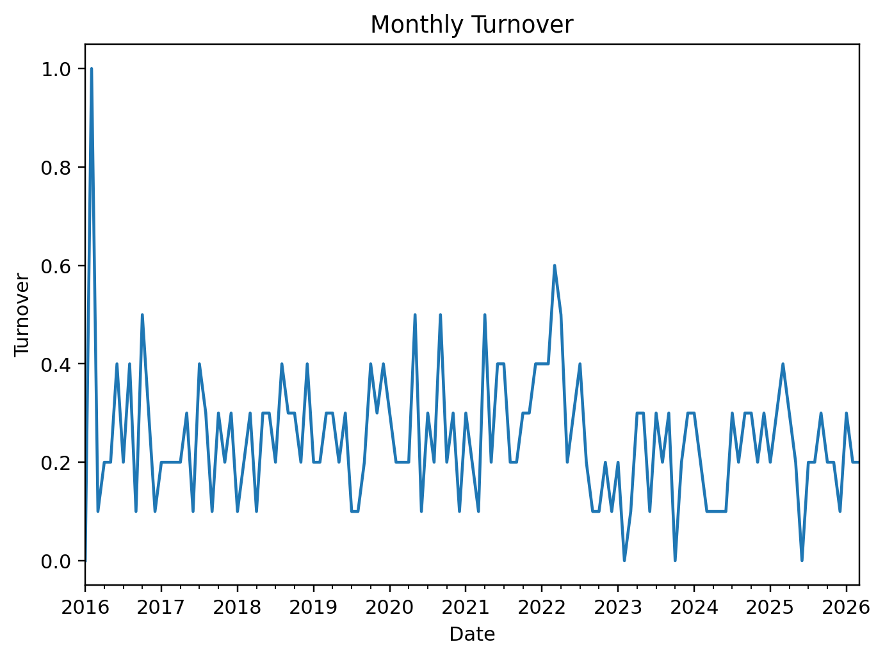

# FTSE 100 Momentum Strategy

## Overview
This project implements a 12–1 momentum strategy on FTSE 100 equities using monthly rebalancing.

The strategy:
- Selects top 10 stocks ranked by 12-month momentum (skipping the most recent month)
- Rebalances monthly
- Includes transaction cost modeling
- Benchmarks against ISF.L (iShares FTSE 100 ETF)

## Strategy Logic
1. Download daily price data via yfinance
2. Convert to month-end prices
3. Compute 12–1 momentum signal
4. Allocate equal weight to top 10 stocks
5. Apply transaction costs
6. Compute equity curve and risk metrics

## Results

## Results

Backtest Period: Jan 2016 – Mar 2026

| Metric | Value |
|--------|--------|
| CAGR | 10.43% |
| Annual Volatility | 14.10% |
| Sharpe Ratio | 0.63 |
| Max Drawdown | -25.6% |
| Beta vs FTSE ETF | 0.79 |
| Avg Monthly Turnover | 24.9% |

The strategy delivered double-digit annualized returns with sub-market beta exposure. 
Risk-adjusted performance (Sharpe 0.63) was achieved with controlled drawdowns 
and moderate turnover, reflecting a systematic but implementable momentum approach.

Note: The universe uses a static FTSE constituent list and does not account for 
delistings or index reconstitutions. The project is intended as a research demonstration.

## Example Output

## Example Output






## How To Run

```bash
pip install -r requirements.txt
python run.py